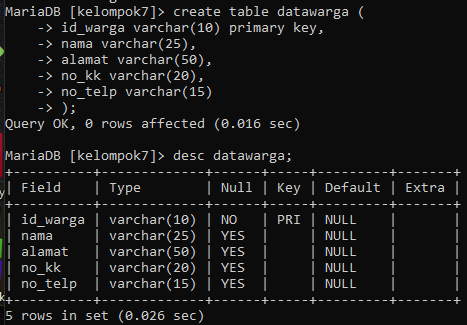
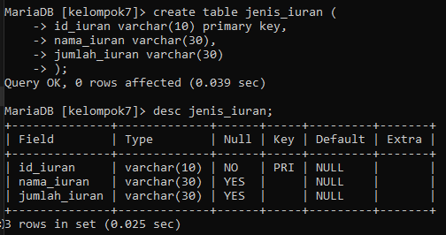
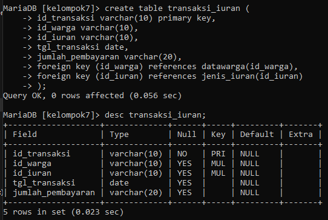
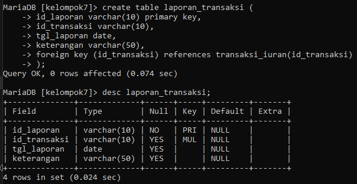
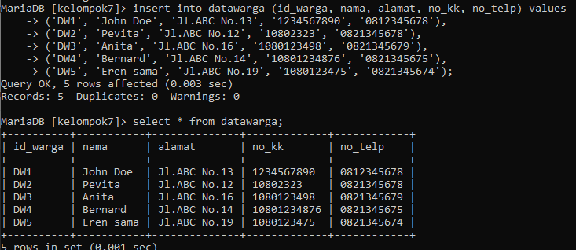
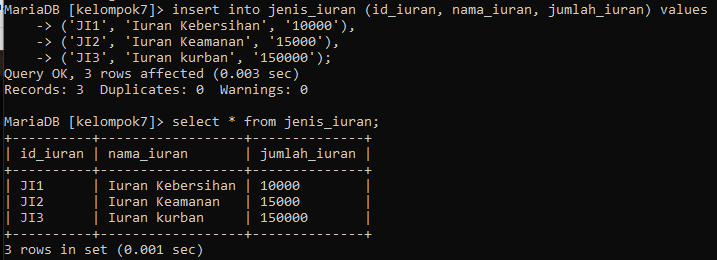
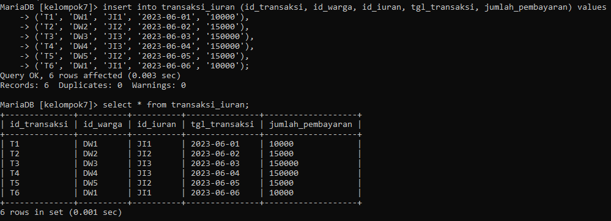
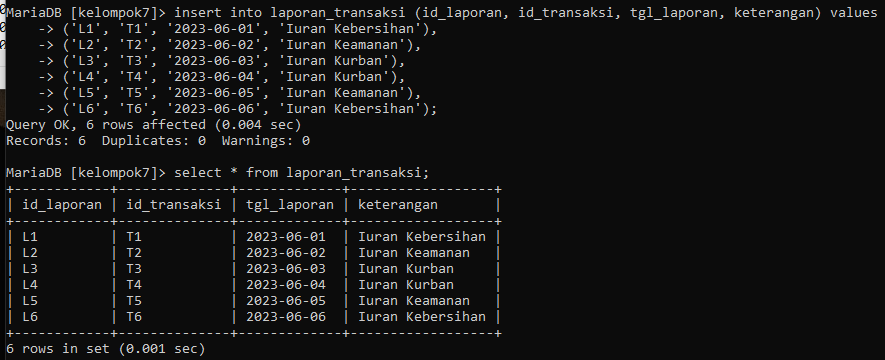
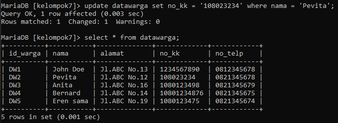
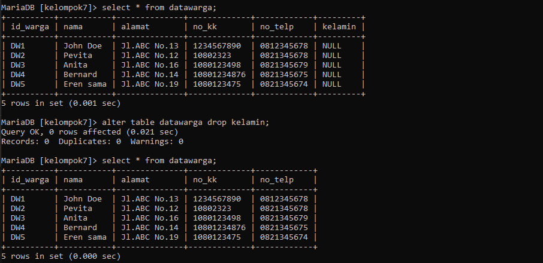

# Kelompok 7 Basis Data Pengelolaan Data Kas RT

```
nama Anggota :
1. Rizky s.f (ketua)
2. M.Hapiyansyah
3. Raja (luffy op(nama github))
4. Faiz 
5. Mizar

```
## 1.Stuktur ER-D (Entity Relationship - Diagram)


```
kami membuat 4 entitas , entitas"nya adalah Data warga, Jenis iuran, transaksi iuran dan laporan transaksi.
penjelasan
* entitas data warga memiliki relationship "bayar" many to many pada entitas data transaksi iuran,
* entitas jenis iuran memiliki relationship "ragam/jenis" one to many pada entitas data transaksi iuran,
* entitas data transaksi iuran memiliki relationship"arsip" many to one pada entitas laporan keuangan 

```
## 2.Membuat DDL (Data Definition Language)

```
untuk tampilan code silahkan klik diatas

```
## 3.SQL CRUD (Create, Read, Update, and Delete)

### - Create Tabel Data Warga



### - Create Tabel Jenis Iuran



### - Create Tabel Transaksi Iuran



### - Create Tabel Laporan Transaksi 



### - Read Tabel Data Warga 



### - Read Tabel Jenis Iuran



### - Read Tabel Transaksi Iuran



### - Read Tabel Laporan Transaksi



### - Update Data Tabel Data Warga



### - Delete Data Tabel Data Warga 



### 4. SQL Join (joining table)

```
sekian laporan pembuatan pengelolaan data KasRT dari kelompok 7, 
Terima Kasih

```
