# Kelompok 7 Basis Data Pengelolaan Data Kas RT

```
nama Anggota :
1. Rizky s.f (ketua)
2. M.Hapiyansyah
3. Raja (luffy op(nama github))
4. Faiz 
5. Mizar

```
## 1. Stuktur ER-D (Entity Relationship - Diagram)

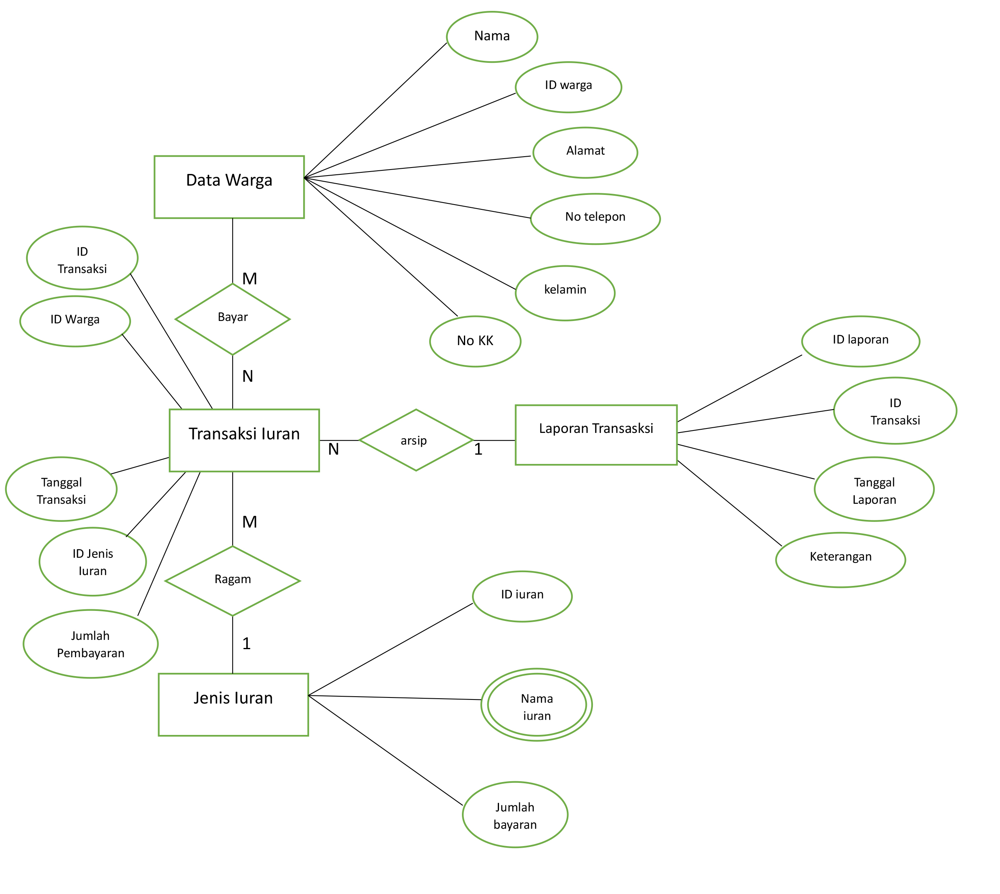

```
kami membuat 4 entitas , entitas"nya adalah Data warga, Jenis iuran, transaksi iuran dan laporan transaksi.
penjelasan
* entitas data warga memiliki relationship "bayar" many to many pada entitas data transaksi iuran,
* entitas jenis iuran memiliki relationship "ragam/jenis" one to many pada entitas data transaksi iuran,
* entitas data transaksi iuran memiliki relationship"arsip" many to one pada entitas laporan keuangan 

```
## 2. membuat DDL (Data Definition Language)

```
untuk tampilan code silahkan klik diatas

```
## 3. SQL CRUD (create, read, update, and delete)

### create table/Membuat tabel

#### -Create Tabel Data Warga

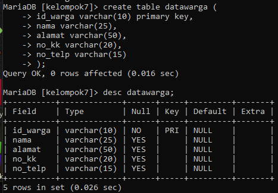

##### -Create Tabel Jenis iuran

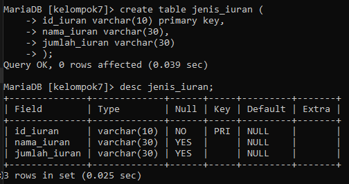

##### -Create Tabel transaksi Pembayaran

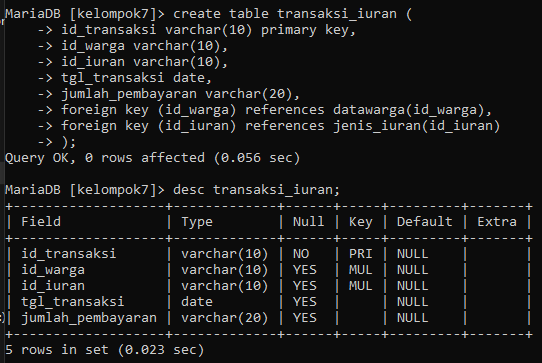

##### -create Tabel laporan transaksi pembayaran

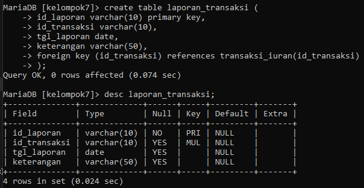

#### (.) Isi data dari masing masing tabel


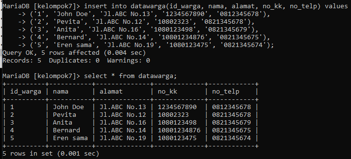
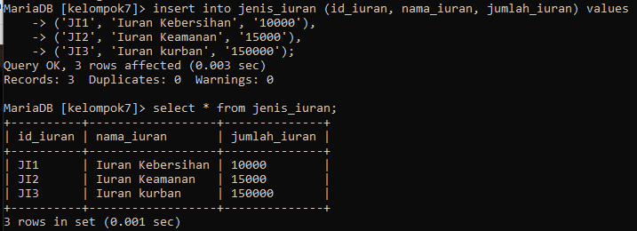
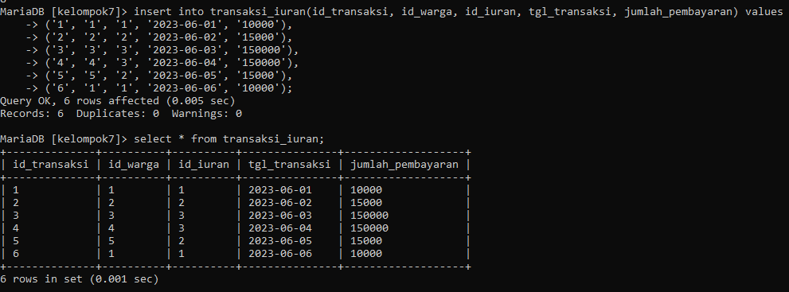
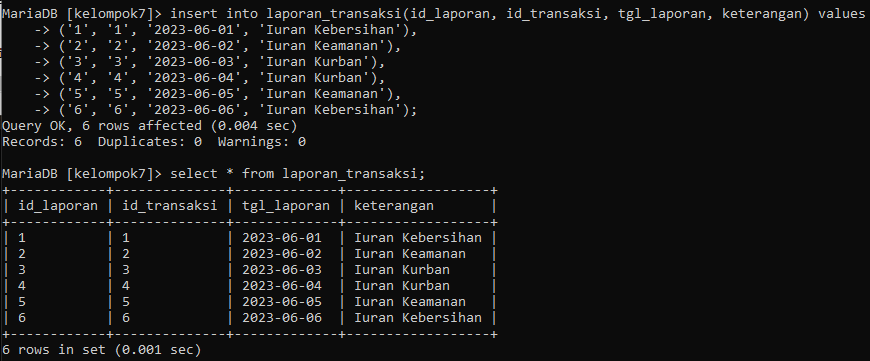


### 4. SQL Join (joining table)


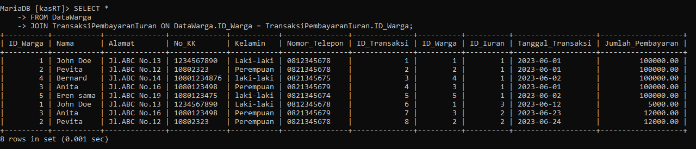
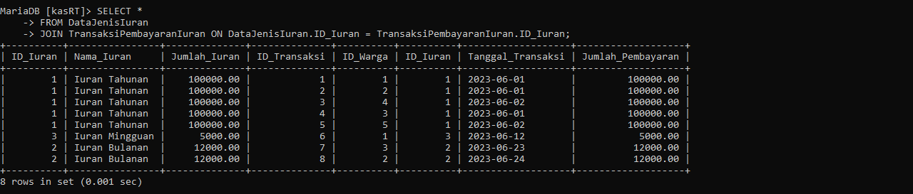
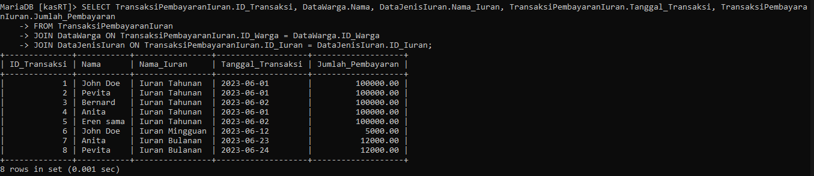
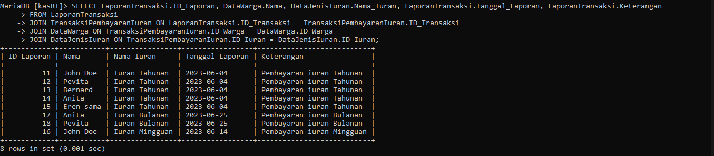

```
sekian laporan pembuatan pengelolaan data KasRT dari kelompok 7, 
Terima Kasih

```
