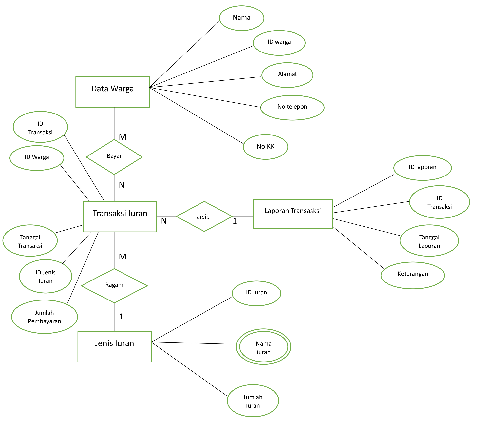

# Kelompok 7 Basis Data Pengelolaan Data Kas RT

```
Nama Anggota :
1. Rizky s.f (312210686) Ketua / Sesepuh
2. M.Hapiyansyah (312210243)
3. Raja H (312210235)
4. Faiz (312210223) 
5. Ryamizar (312210185)

```
## 1. Stuktur ER-D (Entity Relationship - Diagram)



```
 Ada 4 entitas pada data pengelolaan kas RT, entitasnya adalah data warga, jenis iuran, transaksi iuran dan laporan transaksi.

* Entitas data warga memiliki relationship "bayar" many to many pada entitas data transaksi iuran, 
* Entitas jenis iuran memiliki relationship "ragam/jenis" one to many pada entitas data transaksi iuran, 
* Entitas data transaksi iuran memiliki relationship"arsip" many to one pada entitas laporan keuangan.

```
## 2. DDL Script (Data Definition Language)

### - Membuat Database


### - Membuat Tabel Data Warga


### - Membuat Tabel Jenis Iuran


### - Membuat Tabel Transaksi Iuran


### - Membuat Tabel Laporan Transaksi


## 3. SQL CRUD (Create, Read, Update, and Delete)

### - Create/Insert dan Read Tabel Data Warga 


### - Create/Insert dan Read Tabel Jenis Iuran


### - Create/Insert dan Read Tabel Transaksi Iuran


### - Create/Insert dan Read Tabel Laporan Transaksi


### - Update Data Tabel Data Warga


### - Delete Data Tabel Data Warga 


## 4. SQL Join (joining table)

```
sekian laporan pembuatan pengelolaan data KasRT dari kelompok 7, 
Terima Kasih

```
